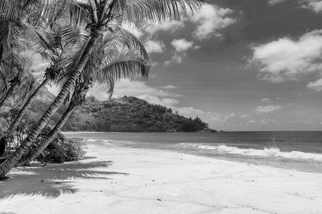

# ⚙️ Acelerando o Processamento de Imagens com Programação Multithread

Trabalho prático desenvolvido para a disciplina **Sistemas Operacionais**, ministrado pelo  
**Prof. Dr. Neumar Costa Malheiros** na **Universidade Federal de Lavras – Campus Paraíso**.

O projeto tem como objetivo aplicar **programação concorrente em Java**, implementando e comparando  
as versões **sequencial** e **multithread** de um programa de **processamento de imagens** em escala de cinza.

---

## 🧩 Objetivo

Demonstrar o ganho de desempenho ao paralelizar o processamento de imagens utilizando **múltiplas threads**,  
comparando o tempo de execução da versão sequencial e da versão multithread.

---

## 🖼️ Descrição do Problema

A tarefa consiste em converter uma imagem colorida para **escala de cinza**, aplicando a média ponderada dos componentes RGB:
Cinza = 0.299×R + 0.587×G + 0.114×B
Na versão **multithread**, a imagem é dividida em **faixas horizontais**, e cada thread processa uma parte da imagem em paralelo.

---

## 🧠 Conceitos Aplicados

- Programação concorrente com **threads**  
- **Divisão de tarefas** e sincronização  
- **Medição de desempenho** e cálculo de **Speedup**  
- Manipulação de imagens com `BufferedImage`  
- Paralelismo de dados e escalabilidade  

---

## ⚙️ Como Executar

1️⃣ Compile os arquivos:
```bash
javac ProcessadorSequencial.java
javac ProcessadorMultithreads.java
```

2️⃣ Execute a versão sequencial:

```bash
java ProcessadorSequencial caminho/para/imagem.jpg
```

3️⃣ Execute a versão multithread (definindo o número de threads):

```bash
java ProcessadorMultithreads caminho/para/imagem.jpg 4
```
O segundo argumento define o número de threads. Exemplo: 4 threads.

📊 Avaliação de Desempenho

O programa exibe o tempo de processamento (em milissegundos).
Com esses valores, calcula-se o Speedup obtido com multithreading:
```ini
Speedup = Tempo_Sequencial / Tempo_Multithread
```

### 📸 Exemplos de Imagens Utilizadas

| Imagem Original | Imagem Processada |
|-----------------|-------------------|
|  |  |

📄 [Enunciado do Trabalho (PDF)](./docs/Trabalho_Pratico_Multithread.pdf)
